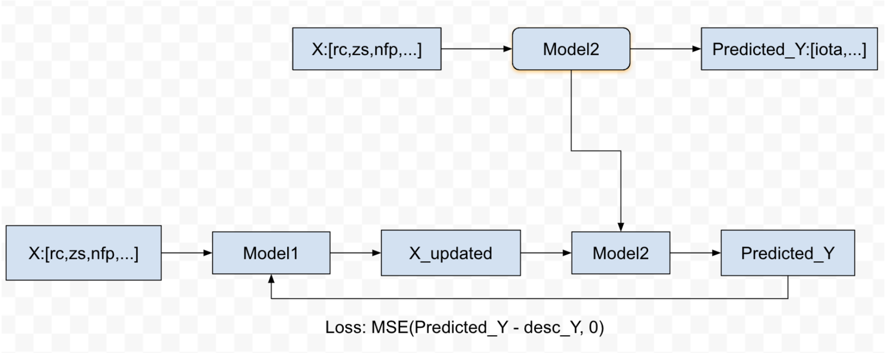
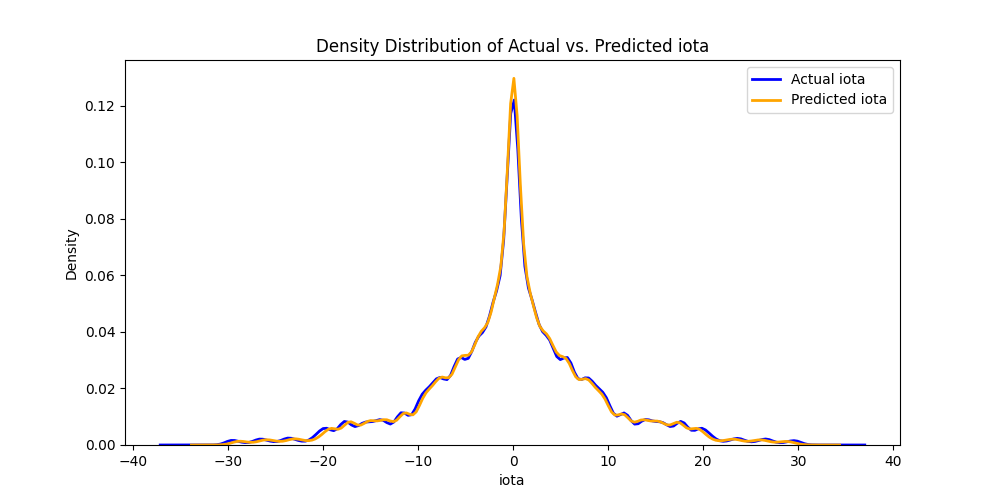
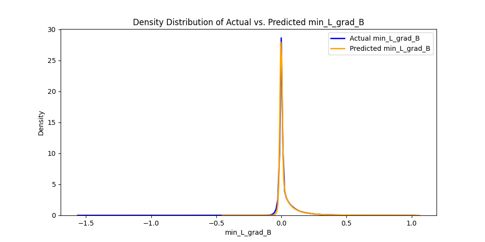

# Stellarator Configuration Optimization Project

## Overview

This project aims to optimize stellarator configurations using machine learning models. The approach leverages the [QSC](https://landreman.github.io/pyQSC/) (Quasisymmetric Stellarator Construction) and [DESC](https://desc-docs.readthedocs.io/) libraries to calculate essential physical parameters, such as magnetic field gradients and plasma beta. These calculations are embedded in the model’s loss function.

The project’s goal is to create a model that refines an initial stellarator configuration, thereby reducing discrepancies between key quantities computed by QSC and DESC. Although this project is still a work in progress, future updates aim to address convergence challenges and enhance the integration of physical constraints.

## Project Workflow

### 1. Configuration Evaluation Using `CHTC` Folder

To start, we utilize scripts in the `CHTC` folder to run DESC and QSC simulations across a range of stellarator configurations. Each valid configuration is processed to compute the following parameters:
- **iota**: Rotational transform,
- **|B|**: Magnitude of the magnetic field,
- **L_grad(B)**: Gradient of the magnetic field

### 2. Model Architecture in the `Desc` Folder

The primary model architecture is as follows:
- **Input (X)**: Initial stellarator configuration parameters.
- **Model**: A neural network model that takes X as input and outputs an updated configuration, **X_updated**.
- **Output (X_updated)**: Updated stellarator configuration.

The **Loss Function** for training the model is defined as:
- Compute physical parameters `Y` using **PyQSC** based on **X_updated**.
- Calculate the difference, `diff`, between `Y` and the fixed output values from Desc
- Minimize `Loss(diff)` to refine the configuration such that the outputs from QSC align closely with those from DESC.

In this setup:
- **X** is the initial stellarator configuration,
- **Y** represents parameters calculated by QSC,
- The model generates optimized configurations that reduce the discrepancy (`diff`) between QSC outputs and precomputed DESC outputs.

## Challenges and Proposed Solutions

### Problem: Non-differentiable PyQSC Calculation

Currently, PyQSC calculations do not support gradient computation, preventing backpropagation through the model. To address this, three potential solutions were considered:

1. **Solution 1 (Implemented)**: Use an auxiliary model (`model2`) to approximate the discrepancy between configurations after passing through QSC and DESC. 
   - `model2` is trained to predict the difference between QSC and DESC outputs based on configurations.
   - **model1** is then trained to generate configurations that reduce this difference using `model2` as the loss function.
   
2. **Solution 2**: Rewrite the QSC and DESC libraries using PyTorch to support autograd.
   
3. **Solution 3**: Manually compute gradients of QSC and DESC outputs.

Currently, the first solution is under investigation due to its feasibility and effectiveness. Solutions 2 and 3 would require extensive modifications to QSC and DESC, so they may be explored later if necessary.

### Solution 1 Workflow in `GradeDesc` Folder

The following illustrates the implemented workflow:

## Performance Evaluation of model2

The following plots demonstrate that `model2` can effectively predict `Y` based on configurations:

Next, we train `model1` to minimize these difference between output from pyQSC and from Desc, allowing it to learn configurations that yield near-zero discrepancies. 

## Future Steps
- The training loss of Model1 gradually decreases, but the validation loss remains almost unchanged, suggesting that the current model1 seems unable to learn how to optimize X.
- Continue to debug the model, adjust the model's hyperparameters, or replace the ResNet used in Model1 with another neural network architecture.
- Test the Model1 output to see if this output can pass QSC and DESC, and check if the difference between the two has decreased.

