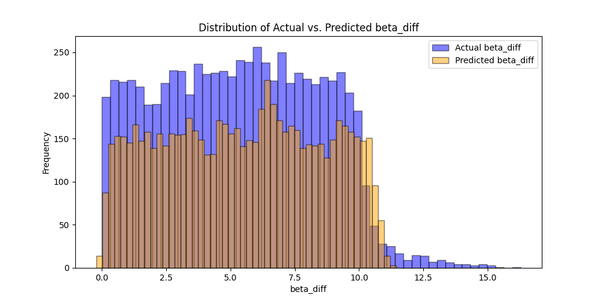
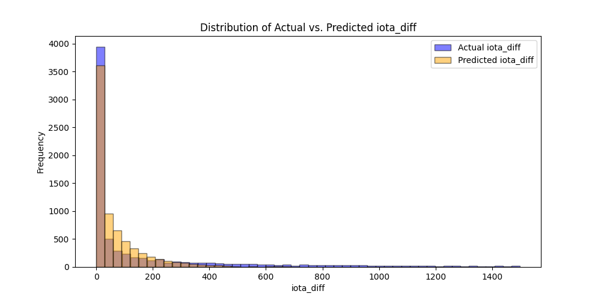
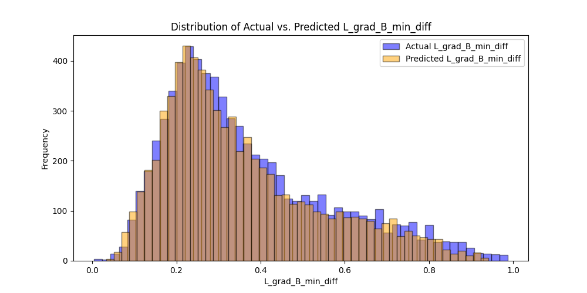
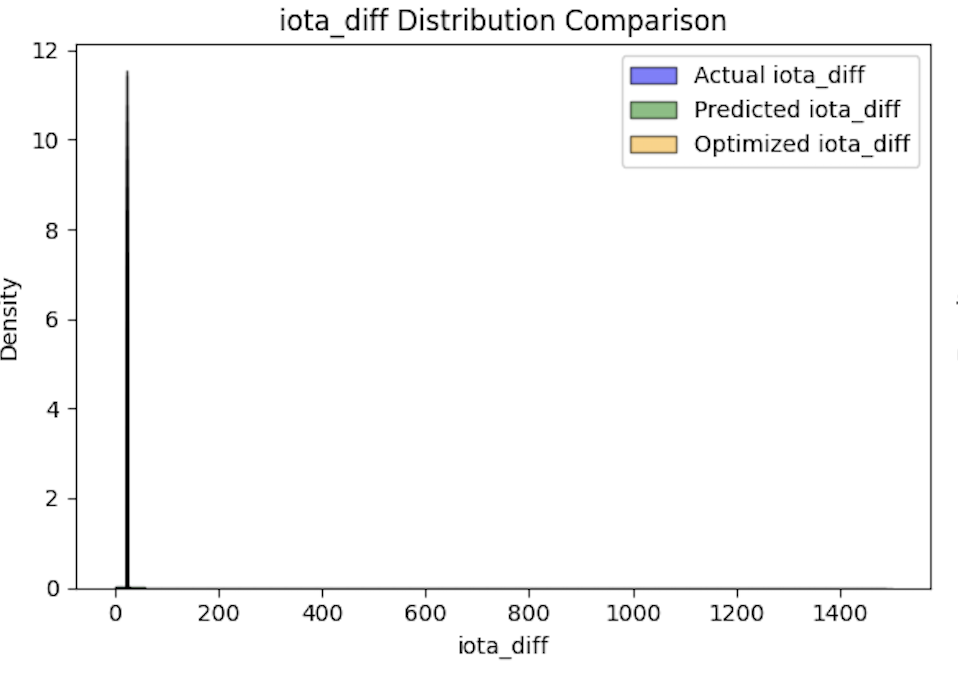
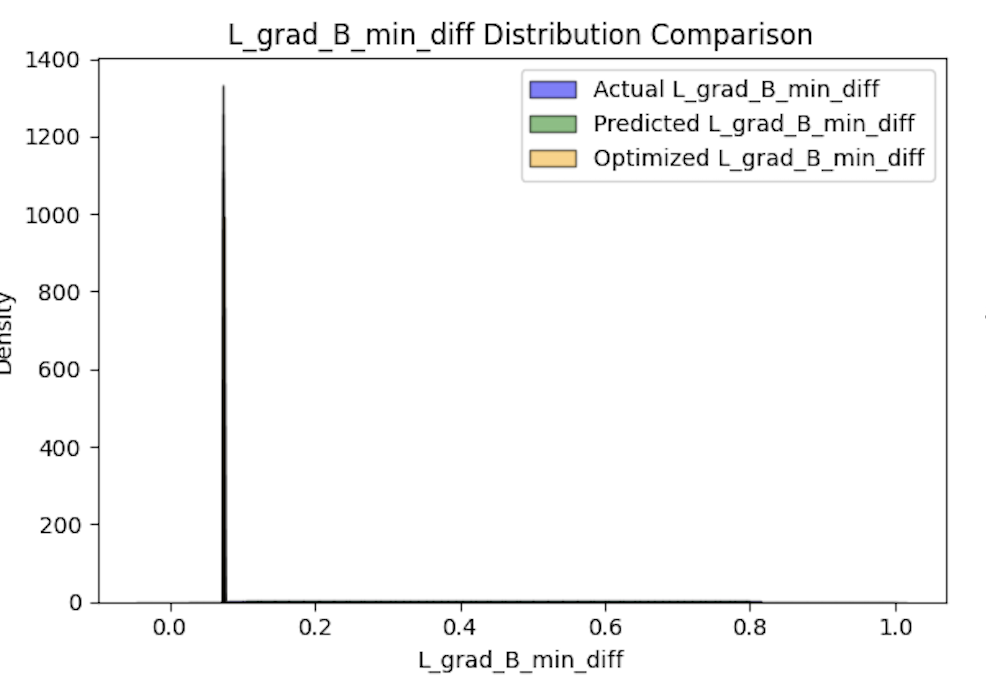

# Stellarator Configuration Optimization Project

## Overview

This project aims to optimize stellarator configurations using machine learning models, including a fully connected neural network. The approach leverages the [QSC](https://landreman.github.io/pyQSC/) (Quasisymmetric Stellarator Construction) and [DESC](https://desc-docs.readthedocs.io/) (Dihedral Equilibrium Stellarator Code) libraries to calculate essential physical parameters, such as magnetic field gradients and plasma beta. These calculations are embedded in the model’s loss function.

The project’s goal is to create a model that refines an initial stellarator configuration, thereby reducing discrepancies between key quantities computed by QSC and DESC. Although this project is still a work in progress, future updates aim to address convergence challenges and enhance the integration of physical constraints.

## Project Workflow

### 1. Configuration Evaluation Using `CHTC` Folder

To start, we utilize scripts in the `CHTC` folder to run DESC and QSC simulations across a range of stellarator configurations. Each valid configuration is processed to compute the following parameters:
- **iota**: Rotational transform,
- **|B|**: Magnitude of the magnetic field,
- **L_grad(B)**: Gradient of the magnetic field, and
- **p**: Pressure.

These values are saved in a file named `computed_desc.csv` in the `Desc` folder for use as reference outputs in the model’s loss function.

### 2. Model Architecture in the `Desc` Folder

The primary model architecture is as follows:
- **Input (X)**: Initial stellarator configuration parameters.
- **Model**: A neural network model that takes X as input and outputs an updated configuration, **X_updated**.
- **Output (X_updated)**: Updated stellarator configuration.

The **Loss Function** for training the model is defined as:
- Compute physical parameters `Y` using **PyQSC** based on **X_updated**.
- Calculate the difference, `diff`, between `Y` and the fixed output values in `computed_desc.csv`.
- Minimize `Loss(diff)` to refine the configuration such that the outputs from QSC align closely with those from DESC.

In this setup:
- **X** is the initial stellarator configuration,
- **Y** represents parameters calculated by QSC,
- The model generates optimized configurations that reduce the discrepancy (`diff`) between QSC outputs and precomputed DESC outputs.

## Challenges and Proposed Solutions

### Problem: Non-differentiable PyQSC Calculation

Currently, PyQSC calculations do not support gradient computation, preventing backpropagation through the model. To address this, three potential solutions were considered:

1. **Solution 1 (Implemented)**: Use an auxiliary model (`model2`) to approximate the discrepancy between configurations after passing through QSC and DESC. 
   - `model2` is trained to predict the difference between QSC and DESC outputs based on configurations.
   - **model1** is then trained to generate configurations that reduce this difference using `model2` as the loss function.
   
2. **Solution 2**: Rewrite the QSC and DESC libraries using PyTorch to support autograd.
   
3. **Solution 3**: Manually compute gradients of QSC and DESC outputs.

Currently, the first solution is under investigation due to its feasibility and effectiveness. Solutions 2 and 3 would require extensive modifications to QSC and DESC, so they may be explored later if necessary.

### Solution 1 Workflow in `GradeDesc` Folder

The following illustrates the implemented workflow:

```python
# Pseudocode for training model1 with model2 as a differentiable approximation of the discrepancy

# Step 1: Compute differences using QSC and DESC
for each configuration:
    desc_output = DESC(configuration)
    qsc_output = QSC(configuration)
    discrepancy = compute_discrepancy(desc_output, qsc_output)  # e.g., iota_difference, B_variance, etc.
    save_to_csv(discrepancy, configuration)

# Step 2: Train model2 to predict discrepancy based on configurations
model2.fit(configurations, discrepancies)

# Step 3: Use model2 as a differentiable loss function to train model1
for epoch in epochs:
    for configuration in configurations:
        optimized_configuration = model1(configuration)
        predicted_discrepancy = model2(optimized_configuration)
        loss = compute_loss(predicted_discrepancy)  # goal is to minimize this discrepancy
        model1.backpropagate(loss)

# Example of discrepancy calculations
iota_difference = data_axis["iota"][0] - qsc.iota
B_variance_onaxis = np.var(data_axis["|B|"])
min_L_grad_B_diff = np.min(data_axis["L_grad(B)"]) - np.min(qsc.L_grad_B)
beta_on_axis_DESC = np.mean(data_axis["p"] * mu_0 * 2 / data_axis["|B|"]**2)
beta_on_axis_NAE = np.mean(qsc.p2 * mu_0 * 2 / qsc.B0**2)
beta_on_axis_diff = beta_on_axis_DESC - beta_on_axis_NAE
```

## Performance Evaluation of model2

The following plots demonstrate that `model2` can effectively predict discrepancies based on configurations:





Next, we train `model1` to minimize these discrepancies, allowing it to learn configurations that yield near-zero discrepancies. The results below show that `model1` can effectively minimize the differences for `iota` and `L_grad(B)`, though additional work is ongoing to improve results for the remaining discrepancy.




## Future Steps

The upcoming objectives include:

- Training model1 to reduce all three discrepancies simultaneously, generating configurations that minimize differences across iota, |B|, and L_grad(B).
- Testing whether these optimized configurations pass both QSC and DESC validations and yield consistent outputs across both models.
- If necessary, revisiting solutions that involve rewriting or differentiating QSC and DESC libraries.

